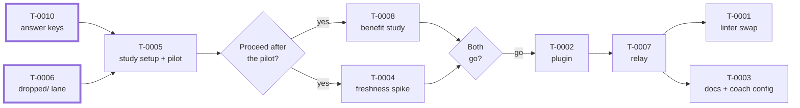

## Context

Tracks the tasks split out of the original T-0001 ("replace markdownlint-cli2 with rumdl") after the research and
coach reviews of 2026-09-25. The goal: let agents navigate Markdown (gol2's docs and the agentpatterns corpus the
coach reviews against) through Claude Code's LSP tool, reading only the sections they need, with rumdl as the
server; adopt it only if it keeps results fresh and makes the coach's reviews better without making them costlier.
If it is adopted, rumdl also replaces markdownlint-cli2 as the gate's Markdown linter, so agents and the gate see
the same diagnostics.

**Claim this epic only once every listed task is in `done/` or `dropped/`.** It holds no work of its own until then,
and claiming it early would tie up an agent's single work-in-progress slot.

The board has no epic type yet, so this is an ordinary task. Its `depends_on` is left empty on purpose: under
T-0006's rule, a task that depends on a dropped task can't leave `backlog/`, and this epic must be able to close
when some of its tasks are dropped. Membership is defined by the `Epic: T-0009.` line in each task's Context, and
each task's own `depends_on` is the source of truth for dependencies; the list and diagram below are reading aids,
so update them by hand when a task is added, split, or dropped.

## Tasks

| Task   | What it does                                                                                                                      |
| ------ | --------------------------------------------------------------------------------------------------------------------------------- |
| T-0010 | Extracts, confirms, and commits the benefit study's answer keys before their transcripts expire (about 2026-10-25)                |
| T-0006 | Adds a terminal `dropped/` lane and evidence conventions to the board                                                             |
| T-0004 | Spike: can a relay keep rumdl's LSP results fresh after shell and git changes? Waits for the user's decision after T-0005's pilot |
| T-0005 | Benefit study setup and pilot: isolated runner, LSP working, pilot, fixed workload                                                |
| T-0008 | Benefit study: are the coach's agentpatterns reviews better with the LSP, without being costlier?                                 |
| T-0002 | In-repo plugin running rumdl's LSP for gol2 and agentpatterns                                                                     |
| T-0007 | Production relay (TypeScript/Node) keeping LSP results fresh                                                                      |
| T-0001 | Replace markdownlint-cli2 with rumdl in the gate                                                                                  |
| T-0003 | `docs/tools/` doc and (on go) the coach's LSP configuration; no `CLAUDE.md` pointer until a retro shows one is needed             |

## Plan

Arrows point from a task to the tasks that depend on it. Diamonds are the user's decisions; a "no" or "no-go" at
any of them moves every task after it to `dropped/`. Tasks with a thick border are in `ready/`.

## Decision points

- **T-0010 first:** the answer keys exist only in transcripts that expire around 2026-10-25.
- **Budget:** the pilot and study together stop and ask the user if projected cost exceeds $50 or the user's
  grading and rating time exceeds 3 hours.
- **After T-0005's pilot:** the user decides whether to run T-0008 and T-0004. If not, T-0008, T-0004, T-0002,
  T-0007, T-0001, and T-0003 move to `dropped/`.
- **After T-0004 and T-0008:** both must recommend go for T-0002 to start. Either no-go drops T-0002, T-0007,
  T-0001, and T-0003.
- **If T-0008 ends not tested, or effectiveness is not measurable:** the user chooses to rerun with changes (as a
  new task), accept a lighter bar, or drop; if the user doesn't choose, the default is to drop, recorded as "not
  shown", not "doesn't help".
- **Merging T-0002 and T-0007:** the user reviews and merges each PR; agents never merge them, since both add
  executable config and agents act on GitHub as the user's account.
- **Every move to `dropped/`** needs the user's agreement (T-0006).

## Outcome

Not decided.
